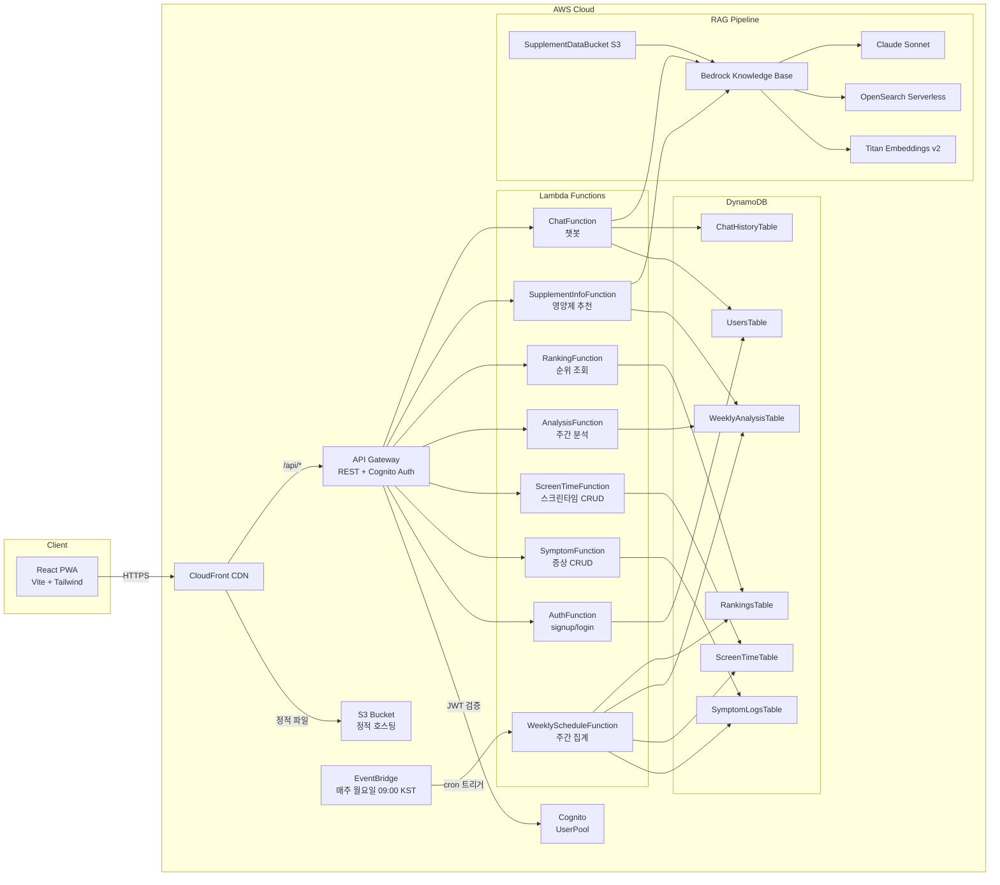
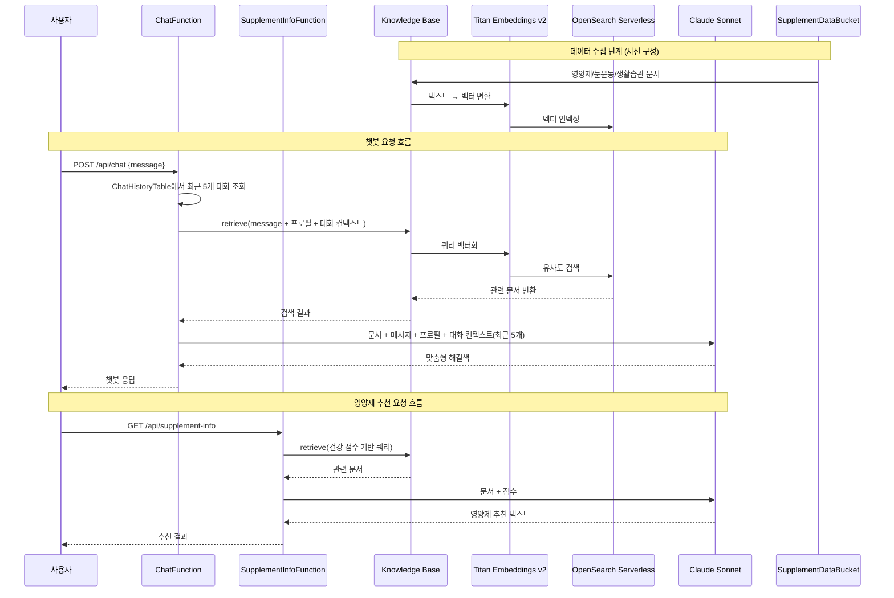

# Design Document: Digital Fatigue Management

## Overview

디지털 피로 관리 앱은 스마트폰 과사용으로 인한 눈 건강 및 디지털 피로를 측정·관리하는 모바일 웹앱(PWA)이다. 사용자는 증상 기록, 스크린타임 추적, 주간 건강 분석, RAG 기반 영양제 추천, 그리고 RAG 기반 챗봇을 통한 맞춤형 해결책을 제공받는다.

### 기술 스택

- **프론트엔드**: React + Vite + Tailwind CSS (PWA, 모바일 우선 UI, 최대 너비 390px)
- **백엔드**: AWS SAM 기반 서버리스 (Node.js 18, async/await)
- **인증**: Amazon Cognito (SRP 인증, JWT 토큰)
- **API**: Amazon API Gateway (REST, Cognito Authorizer, CORS)
- **데이터베이스**: Amazon DynamoDB (6개 테이블)
- **AI/ML**: Amazon Bedrock (Knowledge Base + Claude Sonnet)
- **벡터 검색**: OpenSearch Serverless + Titan Embeddings v2
- **스케줄링**: Amazon EventBridge (주간 자동 집계)
- **배포**: S3 + CloudFront (CDN, HTTPS)

### 리소스 요약

| 카테고리 | 수량 | 상세 |
|---------|------|------|
| API 엔드포인트 | 10개 | signup, login, symptoms(2), screen-time(2), weekly, ranking, supplement-info, chat, chat/history |
| Lambda 함수 | 8개 | Auth, Symptom, ScreenTime, Analysis, Ranking, SupplementInfo, Chat, WeeklySchedule |
| DynamoDB 테이블 | 6개 | Users, SymptomLogs, ScreenTime, WeeklyAnalysis, Rankings, ChatHistory |

## Architecture

### High-Level Architecture



### 설계 결정 사항

1. **단일 Knowledge Base 공유**: Supplement_Service와 Chat_Service가 동일한 Knowledge Base를 공유한다. 영양제 추천 자료와 디지털 피로 해결책(눈 운동, 생활 습관 가이드) 문서를 모두 포함하여 두 서비스가 동일한 벡터 스토어에서 검색한다.
2. **ChatHistoryTable 신규 추가**: 기존 template.yaml에 없는 ChatHistoryTable과 ChatFunction을 추가해야 한다.
3. **ChatFunction Lambda 신규 추가**: POST /api/chat (챗봇 메시지 전송)과 GET /api/chat/history (대화 이력 조회) 두 엔드포인트를 하나의 Lambda에서 처리한다.
4. **모바일 우선 PWA**: 최대 너비 390px 기준으로 최적화하며, vite-plugin-pwa로 Service Worker를 등록하여 오프라인 기본 화면을 지원한다.


## Security

### 전송 중 암호화
- CloudFront는 HTTPS를 강제하며, 모든 HTTP 요청을 HTTPS로 리다이렉트한다.
- API Gateway는 TLS를 통해 클라이언트-서버 간 통신을 암호화한다.

### 저장 시 암호화
- DynamoDB: SSE(Server-Side Encryption)를 AWS 관리형 키로 적용한다.
- S3 (StaticAssetsBucket, SupplementDataBucket): SSE-S3 암호화를 적용한다.

### 인증 및 인가
- Amazon Cognito UserPool에서 발급한 JWT 토큰(AccessToken, IdToken)으로 사용자를 인증한다.
- API Gateway에 CognitoAuthorizer를 적용하여 인증되지 않은 요청을 차단한다.

### 최소 권한 원칙
- 각 Lambda 함수의 IAM 역할은 해당 함수가 필요로 하는 리소스에만 접근 권한을 부여한다.
  - 예: SymptomFunction은 SymptomLogsTable에만 CRUD 권한, ChatFunction은 ChatHistoryTable CRUD + UsersTable Read + Bedrock Retrieve/InvokeModel 권한

### WAF (Web Application Firewall)
- CloudFront 앞에 AWS WAF를 적용하여 DDoS 공격, SQL Injection, XSS 등 일반적인 웹 공격을 방어한다.

### 로깅 및 민감 데이터 보호
- 모든 Lambda 함수의 로그는 CloudWatch Logs에 기록한다.
- 로그에 민감 데이터(이메일, 건강 데이터, 챗봇 대화 내용 등)가 포함되지 않도록 마스킹 처리한다.

### 헬스 데이터 격리
- 사용자 건강 데이터(증상 점수, 스크린타임, 챗봇 대화)는 DynamoDB PK(`USER#<email>`) 기반으로 격리되어 사용자 본인만 접근 가능하다.
- Lambda 함수는 JWT 토큰에서 추출한 사용자 이메일과 PK를 매칭하여 타 사용자 데이터 접근을 원천 차단한다.

## Components and Interfaces

### API 엔드포인트 목록

| # | Method | Path | Lambda | Auth | 설명 |
|---|--------|------|--------|------|------|
| 1 | POST | /api/auth/signup | AuthFunction | NONE | 회원가입 |
| 2 | POST | /api/auth/login | AuthFunction | NONE | 로그인 |
| 3 | POST | /api/symptoms | SymptomFunction | Cognito | 증상 기록 저장 |
| 4 | GET | /api/symptoms | SymptomFunction | Cognito | 증상 기록 조회 |
| 5 | POST | /api/screen-time | ScreenTimeFunction | Cognito | 스크린타임 기록 |
| 6 | GET | /api/screen-time | ScreenTimeFunction | Cognito | 스크린타임 조회 |
| 7 | GET | /api/analysis/weekly | AnalysisFunction | Cognito | 주간 건강 분석 |
| 8 | GET | /api/analysis/ranking | RankingFunction | Cognito | 사용자 순위 조회 |
| 9 | GET | /api/supplement-info | SupplementInfoFunction | Cognito | RAG 영양제 추천 |
| 10 | POST | /api/chat | ChatFunction | Cognito | 챗봇 메시지 전송 |
| 11 | GET | /api/chat/history | ChatFunction | Cognito | 대화 이력 조회 |

### Lambda 함수 상세

#### 1. AuthFunction (`src/handlers/auth.handler`)
- **역할**: 회원가입 및 로그인 처리
- **입력 (signup)**: `{ email, password, age, gender }`
- **입력 (login)**: `{ email, password }`
- **출력 (signup)**: `{ statusCode: 200, body: { message, userId } }`
- **출력 (login)**: `{ statusCode: 200, body: { AccessToken, IdToken, RefreshToken } }`
- **검증 로직**:
  - 이메일 형식 검증 (RFC 5322)
  - 나이: 양의 정수 검증
  - 성별: `male`, `female`, `other` 중 하나
  - 중복 이메일: Cognito UsernameExistsException 처리 → 409
- **의존성**: Cognito UserPool, UsersTable

#### 2. SymptomFunction (`src/handlers/symptom.handler`)
- **역할**: 증상 기록 저장 및 조회
- **입력 (POST)**: `{ eyeFatigue, headache, generalFatigue }` (각 1~5 정수)
- **출력 (POST)**: `{ statusCode: 200, body: { message, logId } }`
- **출력 (GET)**: `{ statusCode: 200, body: { logs: [...] } }` (시간 역순)
- **검증 로직**: 각 점수 1~5 정수 범위, 3개 항목 필수
- **의존성**: SymptomLogsTable

#### 3. ScreenTimeFunction (`src/handlers/screentime.handler`)
- **역할**: 스크린타임 세션 기록 및 조회
- **입력 (POST)**: `{ startTime, endTime }` (ISO 8601 형식)
- **출력 (POST)**: `{ statusCode: 200, body: { message, sessionId } }`
- **출력 (GET)**: `{ statusCode: 200, body: { sessions: [...] } }` (시간 역순)
- **검증 로직**: startTime < endTime, 필수 필드 검증
- **의존성**: ScreenTimeTable

#### 4. AnalysisFunction (`src/handlers/analysis.handler`)
- **역할**: 주간 건강 점수 조회
- **출력 (GET)**: `{ statusCode: 200, body: { weeklyScore, period, details } }`
- **데이터 없음 시**: `{ statusCode: 200, body: { message: "데이터 없음" } }`
- **의존성**: WeeklyAnalysisTable

#### 5. RankingFunction (`src/handlers/ranking.handler`)
- **역할**: 전체 사용자 순위 조회
- **출력 (GET)**: `{ statusCode: 200, body: { rankings: [...], myRank } }`
- **더미 유저 50명 포함**
- **의존성**: RankingsTable

#### 6. SupplementInfoFunction (`src/handlers/supplementInfo.handler`)
- **역할**: RAG 기반 영양제 추천
- **처리 흐름**: WeeklyAnalysisTable에서 점수 조회 → Knowledge Base 벡터 검색 → Claude Sonnet으로 추천 텍스트 생성
- **출력 (GET)**: `{ statusCode: 200, body: { recommendation } }`
- **점수 없음 시**: `{ statusCode: 404, body: { message } }`
- **의존성**: WeeklyAnalysisTable, Bedrock Knowledge Base, Claude Sonnet

#### 7. ChatFunction (`src/handlers/chat.handler`) — 신규
- **역할**: RAG 기반 챗봇 응답 생성 및 대화 이력 관리
- **입력 (POST /api/chat)**: `{ message }` (자유 텍스트)
- **처리 흐름**: UsersTable에서 프로필(나이, 성별) 조회 → ChatHistoryTable에서 최근 5개 대화 이력 조회 → 메시지 + 프로필 + 대화 컨텍스트로 Knowledge Base 벡터 검색 → Claude Sonnet으로 맞춤형 해결책 생성 → ChatHistoryTable에 대화 저장
- **출력 (POST)**: `{ statusCode: 200, body: { response } }`
- **출력 (GET /api/chat/history)**: `{ statusCode: 200, body: { history: [...] } }` (시간순)
- **검증 로직**: 빈 메시지 검증 → 400
- **의존성**: UsersTable, ChatHistoryTable, Bedrock Knowledge Base, Claude Sonnet

##### 대화 컨텍스트 전달 방식
- POST /api/chat 요청 시, ChatHistoryTable에서 해당 사용자의 최근 5개 대화(userMessage + botResponse)를 SK 역순으로 조회한다.
- 조회된 대화 이력을 Claude Sonnet 프롬프트의 대화 컨텍스트로 포함하여, 사용자가 이전 대화를 참조하는 질문(예: "아까 말한 그거")에 대응할 수 있도록 한다.
- 토큰 비용 관리를 위해 컨텍스트에 포함하는 대화 이력을 최근 5개로 제한한다.
- 대화 이력이 없는 경우(첫 대화)에는 컨텍스트 없이 독립적으로 처리한다.

#### 8. WeeklyScheduleFunction (`src/handlers/weeklySchedule.handler`)
- **역할**: 매주 월요일 자동 실행, 주간 데이터 집계
- **트리거**: EventBridge cron(0 0 ? * MON *) — 매주 월요일 UTC 0시 (KST 9시)
- **처리 흐름**: 전주 증상 집계 → 전주 스크린타임 집계 → Weekly_Health_Score 계산 → WeeklyAnalysisTable 저장 → 전체 순위 산출 → RankingsTable 갱신
- **의존성**: SymptomLogsTable, ScreenTimeTable, WeeklyAnalysisTable, RankingsTable

### 프론트엔드 화면 구성

| 화면 | 경로 | 주요 기능 |
|------|------|----------|
| 홈 | `/` | 20분 휴식 타이머, 오늘의 스크린타임 표시 |
| 증상 기록 | `/symptoms` | 눈피로/두통/전신피로 1~5점 설문 입력 |
| 분석 | `/analysis` | 주간 건강 점수, 순위, 영양제 추천 (병렬 API 호출) |
| 챗봇 | `/chat` | 자유 텍스트 입력, 대화 이력, 맞춤형 해결책 응답 |
| 로그인/회원가입 | `/auth` | 이메일/비밀번호 인증 |

#### 타이머 로직 (Service Worker 기반)

20분 휴식 타이머는 Service Worker에서 관리하여 앱이 백그라운드에 있어도 알림을 전송할 수 있도록 한다.

- **Service Worker 타이머 관리**: Service Worker가 `setInterval` 대신 `self.registration.showNotification()`을 사용하여 백그라운드 알림을 전송한다.
- **포그라운드 동기화**: 앱이 포그라운드일 때 React 컴포넌트에서 타이머 UI를 표시하고, Service Worker와 `postMessage`로 타이머 상태를 동기화한다.
- **백그라운드 알림**: 앱이 백그라운드일 때 Service Worker가 독립적으로 타이머를 관리하며, Notification API로 푸시 알림을 전송한다.
- **알림 클릭 동작**: 사용자가 알림을 클릭하면 증상 기록 화면(`/symptoms`)으로 이동하여 즉시 증상을 기록할 수 있도록 유도한다.
- **타이머 간격 설정**: 타이머 간격은 사용자 설정으로 조정 가능하며, 기본값은 20분이다.

### RAG Pipeline 구성



## Data Models

### DynamoDB 테이블 스키마 (6개)

#### 1. UsersTable

| 속성 | 타입 | 설명 |
|------|------|------|
| PK | String | `USER#<email>` |
| email | String | 사용자 이메일 |
| age | Number | 나이 (양의 정수) |
| gender | String | 성별 (`male`, `female`, `other`) |
| createdAt | String | 가입 일시 (ISO 8601) |

#### 2. SymptomLogsTable

| 속성 | 타입 | 설명 |
|------|------|------|
| PK | String | `USER#<email>` |
| SK | String | `LOG#<ISO8601 timestamp>` |
| eyeFatigue | Number | 눈피로 점수 (1~5) |
| headache | Number | 두통 점수 (1~5) |
| generalFatigue | Number | 전신피로 점수 (1~5) |
| createdAt | String | 기록 일시 (ISO 8601) |

#### 3. ScreenTimeTable

| 속성 | 타입 | 설명 |
|------|------|------|
| PK | String | `USER#<email>` |
| SK | String | `SESSION#<ISO8601 timestamp>` |
| startTime | String | 세션 시작 시간 (ISO 8601) |
| endTime | String | 세션 종료 시간 (ISO 8601) |
| durationMinutes | Number | 세션 시간 (분) |
| createdAt | String | 기록 일시 (ISO 8601) |

#### 4. WeeklyAnalysisTable

| 속성 | 타입 | 설명 |
|------|------|------|
| PK | String | `USER#<email>` |
| SK | String | `WEEK#<YYYY-Www>` (예: `WEEK#2024-W03`) |
| weeklyHealthScore | Number | 주간 건강 점수 |
| avgEyeFatigue | Number | 주간 평균 눈피로 |
| avgHeadache | Number | 주간 평균 두통 |
| avgGeneralFatigue | Number | 주간 평균 전신피로 |
| totalScreenTimeMinutes | Number | 주간 총 스크린타임 (분) |
| symptomLogCount | Number | 주간 증상 기록 횟수 |
| period | String | 집계 기간 (예: `2024-01-15 ~ 2024-01-21`) |
| createdAt | String | 집계 일시 (ISO 8601) |

#### 5. RankingsTable

| 속성 | 타입 | 설명 |
|------|------|------|
| PK | String | `WEEK#<YYYY-Www>` |
| SK | String | `RANK#<zero-padded rank>#<email>` (예: `RANK#0001#user@example.com`) |
| email | String | 사용자 이메일 |
| weeklyHealthScore | Number | 주간 건강 점수 |
| rank | Number | 순위 |
| isDummy | Boolean | 더미 유저 여부 |

#### 6. ChatHistoryTable — 신규

| 속성 | 타입 | 설명 |
|------|------|------|
| PK | String | `USER#<email>` |
| SK | String | `CHAT#<ISO8601 timestamp>` |
| userMessage | String | 사용자 입력 메시지 |
| botResponse | String | 챗봇 응답 텍스트 |
| createdAt | String | 대화 일시 (ISO 8601) |

### Weekly_Health_Score 계산 로직

주간 건강 점수는 증상 점수와 스크린타임을 종합하여 산출한다.

```
symptomAvg = (avgEyeFatigue + avgHeadache + avgGeneralFatigue) / 3
symptomScore = (1 - (symptomAvg - 1) / 4) * 60  // 증상 낮을수록 높은 점수, 최대 60점
screenTimeScore = max(0, 40 - (totalScreenTimeMinutes / 7 / 60) * 10)  // 일평균 스크린타임 적을수록 높은 점수, 최대 40점
weeklyHealthScore = round(symptomScore + screenTimeScore)  // 0~100점
```

- 증상 점수 비중: 60% (증상이 낮을수록 높은 점수)
- 스크린타임 비중: 40% (일평균 스크린타임이 적을수록 높은 점수)
- 최종 점수 범위: 0~100점

### template.yaml 변경 사항

기존 template.yaml에 다음 리소스를 추가해야 한다:

1. **ChatHistoryTable** (DynamoDB): PK(String) + SK(String), PAY_PER_REQUEST
2. **ChatFunction** (Lambda): `src/handlers/chat.handler`, Timeout 60s, MemorySize 512
   - Events: POST /api/chat, GET /api/chat/history
   - Policies: DynamoDBCrudPolicy(ChatHistoryTable), DynamoDBReadPolicy(UsersTable), Bedrock Retrieve/InvokeModel
3. **Globals.Function.Environment.Variables**: `CHAT_HISTORY_TABLE: !Ref ChatHistoryTable` 추가

### Knowledge Base 데이터 소스 구성

SupplementDataBucket(S3)에 저장할 문서 카테고리:

| 카테고리 | 파일 예시 | 설명 |
|---------|----------|------|
| NIH 영양소 문서 | lutein.txt, omega3.txt, vitaminA.txt, vitaminC.txt, zinc.txt | 5종 영양소 정보 |
| 눈 운동 가이드 | eye-exercises.txt | 20-20-20 규칙 등 눈 운동 방법 |
| 생활 습관 가이드 | lifestyle-guide.txt | 디지털 피로 예방 생활 습관 |

이 문서들은 Titan Embeddings v2로 벡터화되어 OpenSearch Serverless에 인덱싱되며, Supplement_Service와 Chat_Service 모두에서 공유된다.

### 더미 유저 데이터 생성

순위 기능에 필요한 더미 유저 50명의 데이터는 별도 seed 스크립트로 생성한다.

- **스크립트 위치**: `scripts/seed-dummy-users.js`
- **실행 방식**: 배포 후 1회 수동 실행 (`npm run seed`)
- **동작**: RankingsTable에 더미 유저 50명의 랜덤 Weekly_Health_Score(0~100)와 순위 데이터를 삽입한다. 각 더미 유저의 `isDummy` 필드는 `true`로 설정한다.
- **Lambda 미포함**: 콜드스타트 성능에 영향을 주지 않도록 Lambda 초기화 코드에 포함하지 않는다.
- **package.json 스크립트**: `"seed": "node scripts/seed-dummy-users.js"` 추가

## Correctness Properties

*A property is a characteristic or behavior that should hold true across all valid executions of a system — essentially, a formal statement about what the system should do. Properties serve as the bridge between human-readable specifications and machine-verifiable correctness guarantees.*

### Property 1: 유효한 회원가입 입력은 항상 성공한다

*For any* 유효한 이메일 형식, Cognito 정책을 충족하는 비밀번호, 양의 정수 나이, 허용된 성별 값(male, female, other) 조합으로 회원가입 요청을 보내면, Auth_Service는 statusCode 200을 반환해야 한다.

**Validates: Requirements 1.1**

### Property 2: 유효하지 않은 회원가입 입력은 항상 거부된다

*For any* 회원가입 요청에서 이메일 형식이 유효하지 않거나, 나이가 양의 정수가 아니거나, 성별이 허용된 값이 아닌 경우, Auth_Service는 statusCode 400을 반환하고 사용자 데이터는 저장되지 않아야 한다.

**Validates: Requirements 1.3, 1.4, 1.5**

### Property 3: 유효한 증상 점수는 항상 저장된다

*For any* 1~5 범위의 정수 3개(eyeFatigue, headache, generalFatigue) 조합으로 증상 기록 요청을 보내면, Symptom_Service는 statusCode 200을 반환하고 해당 데이터가 SymptomLogsTable에 저장되어야 한다.

**Validates: Requirements 4.1**

### Property 4: 유효하지 않은 증상 입력은 항상 거부된다

*For any* 증상 기록 요청에서 점수가 1~5 범위 밖이거나 정수가 아니거나 필수 항목이 누락된 경우, Symptom_Service는 statusCode 400을 반환하고 SymptomLogsTable에 데이터가 저장되지 않아야 한다.

**Validates: Requirements 4.2, 4.3**

### Property 5: 증상 기록은 항상 시간 역순으로 조회된다

*For any* 사용자의 증상 기록 목록에 대해, GET /api/symptoms 응답의 logs 배열은 createdAt 기준 시간 역순(최신 → 과거)으로 정렬되어야 한다.

**Validates: Requirements 5.1**

### Property 6: 유효한 스크린타임 세션은 항상 저장된다

*For any* startTime < endTime인 ISO 8601 시간 쌍으로 스크린타임 기록 요청을 보내면, ScreenTime_Service는 statusCode 200을 반환하고 해당 세션이 ScreenTimeTable에 저장되어야 한다.

**Validates: Requirements 6.1**

### Property 7: 유효하지 않은 스크린타임 입력은 항상 거부된다

*For any* 스크린타임 기록 요청에서 startTime >= endTime이거나 필수 필드가 누락된 경우, ScreenTime_Service는 statusCode 400을 반환하고 ScreenTimeTable에 데이터가 저장되지 않아야 한다.

**Validates: Requirements 6.2, 6.3**

### Property 8: 스크린타임 기록은 항상 시간 역순으로 조회된다

*For any* 사용자의 스크린타임 기록 목록에 대해, GET /api/screen-time 응답의 sessions 배열은 createdAt 기준 시간 역순(최신 → 과거)으로 정렬되어야 한다.

**Validates: Requirements 7.1**

### Property 9: Weekly_Health_Score는 증상과 스크린타임을 모두 반영하여 올바르게 계산된다

*For any* 주간 증상 기록 집합(각 1~5점)과 스크린타임 기록 집합에 대해, Weekly_Health_Score 계산 결과는 0~100 범위이며, 증상 평균과 스크린타임 합계를 정의된 공식에 따라 정확히 반영해야 한다.

**Validates: Requirements 8.3, 12.2, 12.3, 12.4**

### Property 10: 순위는 항상 오름차순으로 정렬된다

*For any* 순위 목록에 대해, GET /api/analysis/ranking 응답의 rankings 배열은 rank 값 기준 오름차순으로 정렬되어야 한다.

**Validates: Requirements 9.1**

### Property 11: 주간 집계 후 순위는 점수 기반으로 올바르게 산출된다

*For any* 사용자 집합과 각 사용자의 Weekly_Health_Score에 대해, 순위는 점수가 높은 사용자가 낮은 순위 번호를 가지도록 산출되어야 한다.

**Validates: Requirements 12.5**

### Property 12: 모든 Lambda 응답은 표준 형식을 따르며 예외 시 500을 반환한다

*For any* Lambda 함수 호출에 대해, 응답은 항상 `{ statusCode, body: JSON.stringify({...}) }` 형식이어야 하며, 예상치 못한 예외 발생 시 statusCode 500과 에러 메시지를 반환해야 한다.

**Validates: Requirements 17.3, 17.4**

### Property 13: 챗봇 대화 저장 및 조회 round-trip

*For any* 사용자 메시지와 챗봇 응답 쌍에 대해, ChatHistoryTable에 저장한 후 GET /api/chat/history로 조회하면 저장된 메시지와 응답이 동일하게 반환되어야 하며, 결과는 시간순으로 정렬되어야 한다.

**Validates: Requirements 19.4, 19.8**

### Property 14: 빈 챗봇 메시지는 항상 거부된다

*For any* 빈 문자열 또는 공백만으로 구성된 문자열로 챗봇 메시지를 전송하면, Chat_Service는 statusCode 400을 반환하고 ChatHistoryTable에 데이터가 저장되지 않아야 한다.

**Validates: Requirements 19.6**

## Error Handling

### Lambda 공통 에러 처리 패턴

모든 Lambda 함수는 다음 패턴을 따른다:

```javascript
exports.handler = async (event) => {
  try {
    // 비즈니스 로직
    return { statusCode: 200, body: JSON.stringify({ ... }) };
  } catch (error) {
    console.error('Error:', error);
    return { statusCode: 500, body: JSON.stringify({ message: '서버 오류가 발생했습니다.' }) };
  }
};
```

### 서비스별 에러 코드

| 서비스 | 에러 상황 | statusCode | 메시지 |
|--------|----------|------------|--------|
| Auth (signup) | 중복 이메일 | 409 | 이미 등록된 이메일입니다 |
| Auth (signup) | 입력 검증 실패 | 400 | 구체적 검증 오류 메시지 |
| Auth (login) | 인증 실패 | 401 | 이메일 또는 비밀번호가 일치하지 않습니다 |
| Symptom | 점수 범위/형식 오류 | 400 | 구체적 검증 오류 메시지 |
| Symptom | 필수 항목 누락 | 400 | 누락된 항목 명시 |
| ScreenTime | 시간 범위 오류 | 400 | 시작 시간이 종료 시간보다 늦습니다 |
| ScreenTime | 필수 필드 누락 | 400 | 누락된 필드 명시 |
| SupplementInfo | 주간 점수 없음 | 404 | 주간 분석 데이터가 필요합니다 |
| SupplementInfo | Bedrock/Claude 실패 | 500 | 서비스 오류 메시지 |
| Chat | 빈 메시지 | 400 | 메시지를 입력해주세요 |
| Chat | Bedrock/Claude 실패 | 500 | 서비스 오류 메시지 |
| API Gateway | 인증 실패 | 401 | Unauthorized |
| 모든 Lambda | 예상치 못한 에러 | 500 | 서버 오류가 발생했습니다 |

### 프론트엔드 에러 처리

- API 호출 실패 시 사용자에게 오류 메시지 표시
- 분석 화면: 부분 실패 시 실패한 섹션만 오류 표시, 성공한 섹션은 정상 렌더링
- 챗봇: API 실패 시 오류 메시지와 재전송 옵션 제공
- 네트워크 오프라인: Service Worker 캐시로 기본 화면 표시

## Testing Strategy

### 테스트 프레임워크

- **단위 테스트**: Jest (Node.js Lambda 함수) + React Testing Library (프론트엔드 컴포넌트)
- **Property-Based 테스트**: fast-check (JavaScript/TypeScript PBT 라이브러리)
- **최소 반복 횟수**: Property 테스트당 100회 이상

### 단위 테스트 범위

단위 테스트는 다음 항목에 집중한다:

- 특정 예시 기반 동작 확인 (예: 중복 이메일 가입 → 409)
- 에지 케이스 (예: 빈 조회 결과 → 빈 배열, 주간 데이터 없음 → 안내 메시지)
- 외부 서비스 모킹 (Cognito, Bedrock, DynamoDB)
- 프론트엔드 컴포넌트 렌더링 및 인터랙션
- 통합 포인트 (API 호출 → 응답 처리)

### Property-Based 테스트 범위

각 correctness property에 대해 하나의 property-based 테스트를 작성한다:

| Property | 테스트 설명 | 태그 |
|----------|-----------|------|
| Property 1 | 유효한 회원가입 입력 생성 → 200 확인 | Feature: digital-fatigue-management, Property 1: 유효한 회원가입 입력은 항상 성공한다 |
| Property 2 | 유효하지 않은 회원가입 입력 생성 → 400 확인 | Feature: digital-fatigue-management, Property 2: 유효하지 않은 회원가입 입력은 항상 거부된다 |
| Property 3 | 유효한 증상 점수 생성 → 200 및 저장 확인 | Feature: digital-fatigue-management, Property 3: 유효한 증상 점수는 항상 저장된다 |
| Property 4 | 유효하지 않은 증상 입력 생성 → 400 확인 | Feature: digital-fatigue-management, Property 4: 유효하지 않은 증상 입력은 항상 거부된다 |
| Property 5 | 랜덤 증상 기록 저장 후 조회 → 시간 역순 확인 | Feature: digital-fatigue-management, Property 5: 증상 기록은 항상 시간 역순으로 조회된다 |
| Property 6 | 유효한 스크린타임 세션 생성 → 200 및 저장 확인 | Feature: digital-fatigue-management, Property 6: 유효한 스크린타임 세션은 항상 저장된다 |
| Property 7 | 유효하지 않은 스크린타임 입력 생성 → 400 확인 | Feature: digital-fatigue-management, Property 7: 유효하지 않은 스크린타임 입력은 항상 거부된다 |
| Property 8 | 랜덤 스크린타임 기록 저장 후 조회 → 시간 역순 확인 | Feature: digital-fatigue-management, Property 8: 스크린타임 기록은 항상 시간 역순으로 조회된다 |
| Property 9 | 랜덤 증상/스크린타임 데이터 → 점수 계산 공식 검증 | Feature: digital-fatigue-management, Property 9: Weekly_Health_Score는 올바르게 계산된다 |
| Property 10 | 랜덤 순위 데이터 조회 → 오름차순 정렬 확인 | Feature: digital-fatigue-management, Property 10: 순위는 항상 오름차순으로 정렬된다 |
| Property 11 | 랜덤 사용자 점수 집합 → 순위 산출 정확성 확인 | Feature: digital-fatigue-management, Property 11: 순위는 점수 기반으로 올바르게 산출된다 |
| Property 12 | 랜덤 Lambda 호출 → 응답 형식 및 예외 처리 확인 | Feature: digital-fatigue-management, Property 12: Lambda 응답은 표준 형식을 따른다 |
| Property 13 | 랜덤 대화 저장 후 조회 → round-trip 확인 | Feature: digital-fatigue-management, Property 13: 챗봇 대화 저장 및 조회 round-trip |
| Property 14 | 빈/공백 문자열 생성 → 400 확인 | Feature: digital-fatigue-management, Property 14: 빈 챗봇 메시지는 항상 거부된다 |

### 테스트 구성

```
tests/
├── unit/
│   ├── handlers/
│   │   ├── auth.test.js
│   │   ├── symptom.test.js
│   │   ├── screentime.test.js
│   │   ├── analysis.test.js
│   │   ├── ranking.test.js
│   │   ├── supplementInfo.test.js
│   │   ├── chat.test.js
│   │   └── weeklySchedule.test.js
│   └── frontend/
│       ├── components/
│       └── pages/
└── property/
    ├── auth.property.test.js
    ├── symptom.property.test.js
    ├── screentime.property.test.js
    ├── analysis.property.test.js
    ├── ranking.property.test.js
    ├── chat.property.test.js
    └── lambda-common.property.test.js
```

### fast-check 설정 예시

```javascript
const fc = require('fast-check');

// Feature: digital-fatigue-management, Property 9: Weekly_Health_Score는 올바르게 계산된다
test('Weekly_Health_Score는 증상과 스크린타임을 반영하여 0~100 범위로 계산된다', () => {
  fc.assert(
    fc.property(
      fc.array(fc.record({
        eyeFatigue: fc.integer({ min: 1, max: 5 }),
        headache: fc.integer({ min: 1, max: 5 }),
        generalFatigue: fc.integer({ min: 1, max: 5 }),
      }), { minLength: 1 }),
      fc.array(fc.record({
        durationMinutes: fc.integer({ min: 1, max: 480 }),
      }), { minLength: 1 }),
      (symptoms, screenTimes) => {
        const score = calculateWeeklyHealthScore(symptoms, screenTimes);
        return score >= 0 && score <= 100;
      }
    ),
    { numRuns: 100 }
  );
});
```
